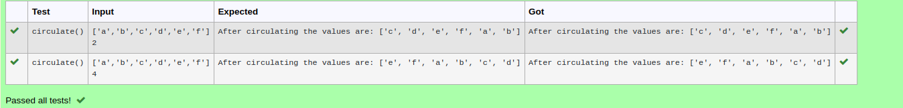

# Circulate-the-values-of-N-variables
## Aim:
To write a python program to circulate the n variables using function concept
## Equipment’s required:
PC
Anaconda - Python 3.7
## Algorithm: 
Step 1: Define a function circulate.

Step 2: Take l and n as inputs.

Step 3: Get the value from the user for the number of rotation

Step 4: Using the slicing concept rotate the list

Step 5: Using print function, print the results.

Step 6: End the program

### Step 1: 
create a function for circulate
### Step 2: 
get the input of list
### Step 3: 
Get the value from the user for the number of rotation
### Step 4: 
Using the slicing concept rotate the list
### Step 5: 
print the circulated list
### Step 6: 
call the function for execution
## Program:
```
#Program to circulate N values.
#Developed by: HARISH RAGAVENDRA S
#RegisterNumber:22008967
def circulate():
    l=eval(input())
    n=int(input())
    l=l[n:]+l[:n]
    print("After circulating the values are:",l)
    
```

## Output:


## Result:
thus the program executed sucessfully
